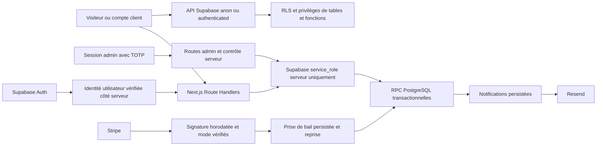

# AVANA — audit base de données et transactions

Date : 2026-09-14. Périmètre : SQL du dépôt, accès serveur Supabase, commandes,
checkout, remboursements, notifications et réception des événements Stripe.
Les services externes et les paramètres réellement déployés n'ont pas été modifiés.

## Résultat vérifié

- 19 tables applicatives avec RLS ; séparation effective des profils, adresses,
  commandes, lignes, événements publics et expéditions entre A, B et anonyme.
- INSERT, UPDATE, DELETE directs refusés aux rôles `anon` et `authenticated` sur
  les 19 tables ; RPC transactionnelles et administratives réservées au serveur.
- Les métadonnées d'inscription `role: admin` ne donnent pas le rôle administrateur.
- Prix lus dans le catalogue SQL ; réservations, validation du paiement et remise
  en stock transactionnelles ; rejeux de paiement/remboursement sans double stock.
- Deux défauts P2 corrigés, dont un reproduit par une erreur PostgreSQL réelle
  avant correction. Aucun P0/P1 exploitable supplémentaire confirmé dans ce périmètre.
- 46 tests comportementaux PostgreSQL passent. Avec les suites existantes de
  garde-fous SQL et de sécurité paiement : 58 tests passent.

## Corrections

### DB-01 — P2 : déduplication des notifications incompatible avec PostgREST

**Avant.** `lib/server/notifications.ts` utilise `upsert` avec `onConflict:
"dedupe_key"`. `supabase/commerce.sql` fournissait seulement un index UNIQUE
partiel `WHERE dedupe_key IS NOT NULL`. PostgreSQL ne peut pas inférer cet index
pour `ON CONFLICT (dedupe_key)` sans prédicat. Résultat reproduit : SQLSTATE
`42P10`, échec de mise en file des liens d'accès, alertes et notifications admin.
L'appel suivant un paiement peut aussi faire échouer le traitement du webhook.

**Après.** Ajout de `notifications_dedupe_upsert_idx`, index UNIQUE complet.
PostgreSQL autorise déjà plusieurs valeurs NULL dans cet index. L'index existant,
les données et les garanties de déduplication sont conservés. Correction dans le
schéma initial et `20260914000000_notification_upsert.sql`.

**Preuve.** Test du vrai `INSERT ... ON CONFLICT (dedupe_key) DO NOTHING`.
Une seconde base jetable reproduit la version 4 avec son index UNIQUE partiel
actif, constate `42P10`, applique deux fois la migration intégrale, puis vérifie
la déduplication et la conservation des deux notifications à clé NULL.

### DB-02 — P2 : webhook acquitté pendant un traitement interrompu

**Avant.** `claim_payment_event` renvoyait `false` pour un événement terminé ou
encore sous un bail de traitement de dix minutes. Le Route Handler répondait
`200 duplicate` dans les deux cas. Après arrêt brutal d'un worker, un nouvel
envoi Stripe avant expiration pouvait être acquitté alors que les effets n'étaient
pas terminés. Les remboursements et litiges n'ont pas de reprise complète dans
le cron ; la réconciliation du checkout ne couvre pas tous ces effets.

**Après.** `lib/server/orders.ts` distingue `claimed`, `processed` et `busy` par
lecture de l'état persisté lorsque la prise de bail échoue.
`app/api/webhooks/stripe/route.ts` répond `503` avec `Retry-After: 60` pendant un
traitement en cours, et `200 duplicate` seulement pour un événement terminé.
La signature SQL, la durée du bail et les transitions de paiement sont conservées.

**Preuve.** Route Handler réel, signature générée et vérifiée par le SDK Stripe,
RPC et états réels dans PostgreSQL : bail actif → 503 sans modification du bail ;
bail expiré → reprise puis 200 ; événement terminé → 200 sans retraitement ;
webhook non signé → 400 sans création d'événement.

### DB-03 — P3 : préparation au lancement fondée sur une colonne inexistante

`lib/server/readiness.ts` demandait `payment_events.created_at`, absent du schéma.
Le tableau de préparation affichait donc une erreur de migration. Il utilise
désormais `processed_at` et uniquement les événements `processed`.
La sonde de santé et la préparation au lancement exigent la version SQL 5, qui
inclut l'index compatible avec les notifications. Ce changement corrige un
indicateur d'exploitation ; il ne constitue pas une nouvelle barrière au checkout.

## Architecture et frontières de confiance

Le serveur utilise une clé qui contourne RLS. Les routes doivent donc vérifier
l'identité, l'autorisation et les entrées avant tout accès privilégié. Le filtre
`customer_id`, les contrôles d'ownership des RPC d'adresses et les DTO publics
restent nécessaires même si les politiques RLS sont correctes.

Les fonctions `SECURITY DEFINER` métier fixent `search_path = public` et leurs
objets applicatifs sont qualifiés. Leur EXECUTE est retiré de PUBLIC/anon/
authenticated puis accordé à `service_role`. `is_admin()` est une exception
nécessaire aux politiques SELECT ; `handle_new_user()` est un déclencheur.
Les utilisateurs ne peuvent pas écrire leur rôle ni invoquer les RPC admin.

`profiles`, `customer_addresses`, `orders`, `order_items`, `order_status_events`
et `shipments` ont des politiques de lecture par propriétaire ; les événements
internes ne sont pas exposés. `products` et `product_variants` permettent la
lecture du catalogue actif. Les autres tables métier sont internes, sans
politique SELECT publique, ou avec privilèges complètement révoqués.

Les transactions de réservation verrouillent les variantes et ordonnent les
articles ; le montant provient de la base. Le paiement vérifie la session
attachée, le sous-total et la livraison. Les remises restent permises parce
qu'elles proviennent d'une session Stripe signée, corrélée et créée côté serveur.
Une signature n'est pas remplacée par la confiance dans un prix fourni par le client.

## Limites et points transmis à l'audit général

- Le rattachement des commandes invitées à une adresse repose sur une adresse
  réellement vérifiée. Le manque initial de garde explicite sur l'identité
  Supabase confirmée a été transmis à l'audit d'authentification. L'exploitabilité
  dépend des réglages de confirmation et des fournisseurs Auth déployés.
- La relecture du consentement avant expédition d'une campagne déjà en file a
  été corrigée par l'audit général des notifications et vérifiée par huit tests.
  Voir le [rapport consolidé](../../SECURITY_HARDENING_2026-09-14.md) pour les
  limites d'un envoi déjà accepté par le fournisseur.
- La politique SQL `is_admin()` autorise explicitement `staff`, `admin`,
  `founder` à lire les données de plusieurs comptes. Cette voie utilise Supabase
  Auth ; elle est distincte du TOTP de l'administration web. Vérifier les comptes
  auxquels ces rôles sont attribués et leur MFA en staging. Aucun rôle réel n'a
  été lu ou changé ici ; pas de défaut d'escalade directe démontré.
- Le contrat de test reproduit les privilèges par défaut permissifs de Supabase.
  Le dépôt révoque les écritures exposées ; les privilèges SQL auxiliaires hérités
  et CREATE du schéma doivent être contrôlés sur le projet déployé. Aucun chemin
  PostgREST vers TRUNCATE/CREATE arbitraire n'a été démontré.
- Les paramètres des buckets sont validés en SQL ; les ACL de `storage.objects`,
  anciennes policies, objets déjà publics et URLs signées réellement déployés
  nécessitent un contrôle de l'environnement Supabase.
- PGlite exécute PostgreSQL en WASM. C'est une vraie exécution SQL, pas une
  recherche de texte, mais une seule session : les courses entre connexions,
  l'infrastructure Supabase, GoTrue, PostgREST et Storage HTTP restent à tester
  sur staging. Aucun service externe n'a été contacté par la suite.

## Déploiement et validation restants

1. Tester sur une copie de staging puis appliquer les migrations manquantes,
   dont `20260914000000_notification_upsert.sql`. La construction d'un index
   peut retenir des écritures pendant son exécution ; planifier selon la taille
   réelle de la table. Aucun accès à la base distante n'a été fait.
2. Vérifier la version 5 et l'absence d'erreur sur les indicateurs de préparation.
3. Tester deux comptes confirmés réels et anon via PostgREST ; vérifier les
   privilèges/policies effectivement déployés et les buckets/objets.
4. Passer une commande Stripe test, un remboursement, un rejeu de webhook et
   vérifier les alertes, le stock et la file de notifications après interruption.

Commandes exécutées après correction : tests PostgreSQL et suites SQL/paiement
(58 réussis), `npm run typecheck`, ESLint ciblé. Le build complet et le rescan
global sont consolidés dans le rapport général de l'audit.

Outils effectivement utilisés pour ce sous-audit : compétences ECC
`postgres-patterns` et `backend-patterns`, documentation Next locale,
PowerShell/ripgrep, Vitest, TypeScript, ESLint, PGlite 0.5.8 et SDK Stripe.
Docker a été interrogé : CLI présent, moteur arrêté ; aucun service démarré.
Ni Codex Security distant, ni 42Crunch, ni une base Supabase distante n'ont été
exécutés par ce sous-audit. Les outils de l'audit général sont rapportés séparément.

Référence de l'outil embarqué : [documentation PGlite](https://pglite.dev/docs/about)
et [extension pgcrypto](https://pglite.dev/extensions/#pgcrypto).
